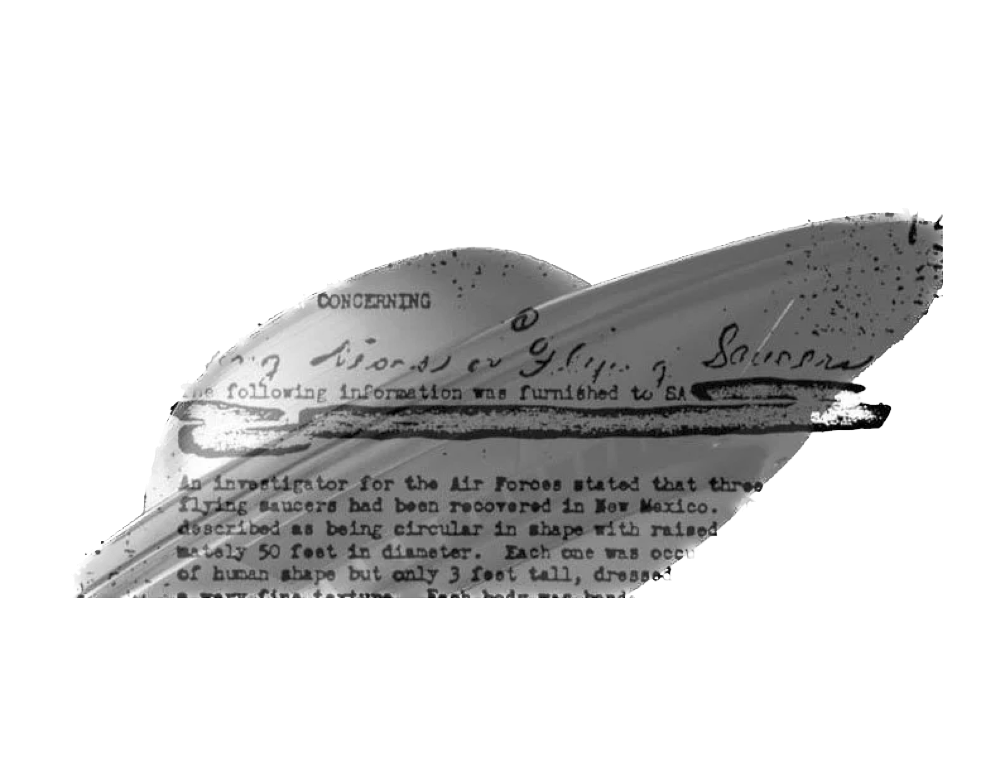

# Introducing object-oriented design #

UFO sightings are gaining increasing attention from both the public and the government. We want to take the next step in
making our code easy to use and to extend.

The final part of this workshop will recast the code in our experiment around objects with attributes and actions, which
in Python (and most other languages supporting OOP) are called _classes_. Up to this point our we have expressed this
experiment as a series of isolated actions — this is particularly evident in the `main()` routine of our final script.
However, we can instead describe the work being done in terms of the behaviour of a `Sightings` object, which has
actions (_methods_ in the lingo of OOP) that use its internal attributes to produce the plots and classifier training we
need.

## Why classes? ##

Classes were invented with the express purpose of making our lives easier as programmers, not to make the code faster or
to make it possible for it to do something it hadn't done before. We will keep this important principle in mind as we
delve into creating a OOP-based version of our UFO sightings pipeline.

## A) Reworking a repository around classes ##

We have created two families of classes: `SightingsDatabase` and `Sightings`. The rationale behind this is that
there are fundamentally two objects that are used in our pipeline: the dataset of all valid sightings that we could
consider in our analysis, and the sightings totals across a set of time periods that we use to train a particular
predictor. A good class design also does a good job of encapsulating the relationship between classes in a succinct way:
here, we see that databases produce sightings using `get_sightings()`.

The steps of our pipeline can now be expressed in terms of actions done by instances of these classes. We define a
special class method `__init__()` that is called every time a new class member is created:
`sights_data = SightingsDataset(*args.years, ...)`. This is where we create the attributes of the object: the static
properties that each member of the class is expected to have defined (and to be defined by). In our case we also handle
data scraping during instantiation, as we know we will only want to read in each range of years exactly once.

In addition to producing a sightings totals given a frequency in `get_sightings()`, the `SightingsDataset` class can
also be asked to produce a static map of the total sightings by state using `plot_totals_map()`. We take advantage of
the fact that each dataset instance has all the data we need to do our analyses under `self.sights_data`. On the other
hand, a `Sightings` instance only has the totals for one particular choice of measurement frequency, so we use it for
making our animated totals map and for training the prediction algorithm, which are dependent on this choice.

## B) Refactoring our class design ##

"Refactoring" is a fancy software engineering term that means "fixing the underlying structure of the code". This means
we are not looking to fix bugs; we are starting with a working piece of code and would like to make the code itself
cleaner and better organized by rearranging major parts.

What parts of our `PredUFO` package need refactoring? When using classes, one good heuristic when looking for
opportunities to improve the design of the classes and their relationships to one another is to look for long
`if...elif` clauses, especially those with highly heterogenuous behaviours in each of the subclauses. These suggest that
the corresponding routine is struggling to deal with an input in a contained manner, and that each of these subclauses
should be handled within its own class.
